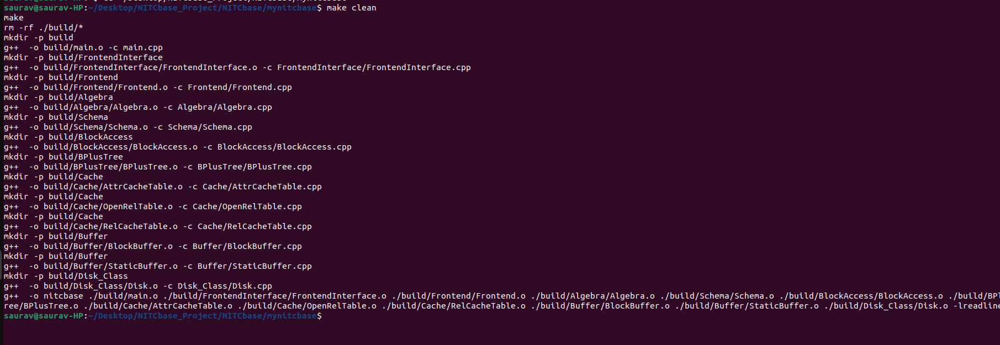
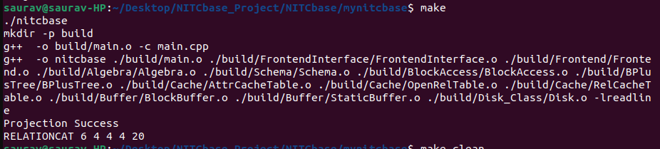
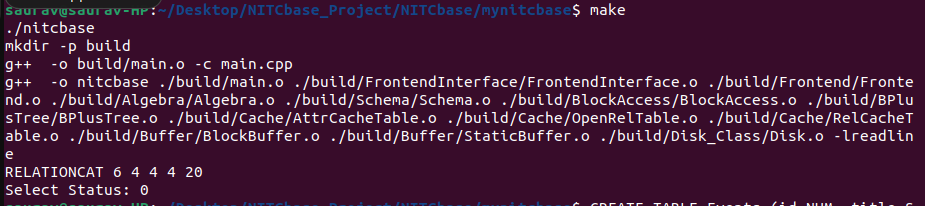
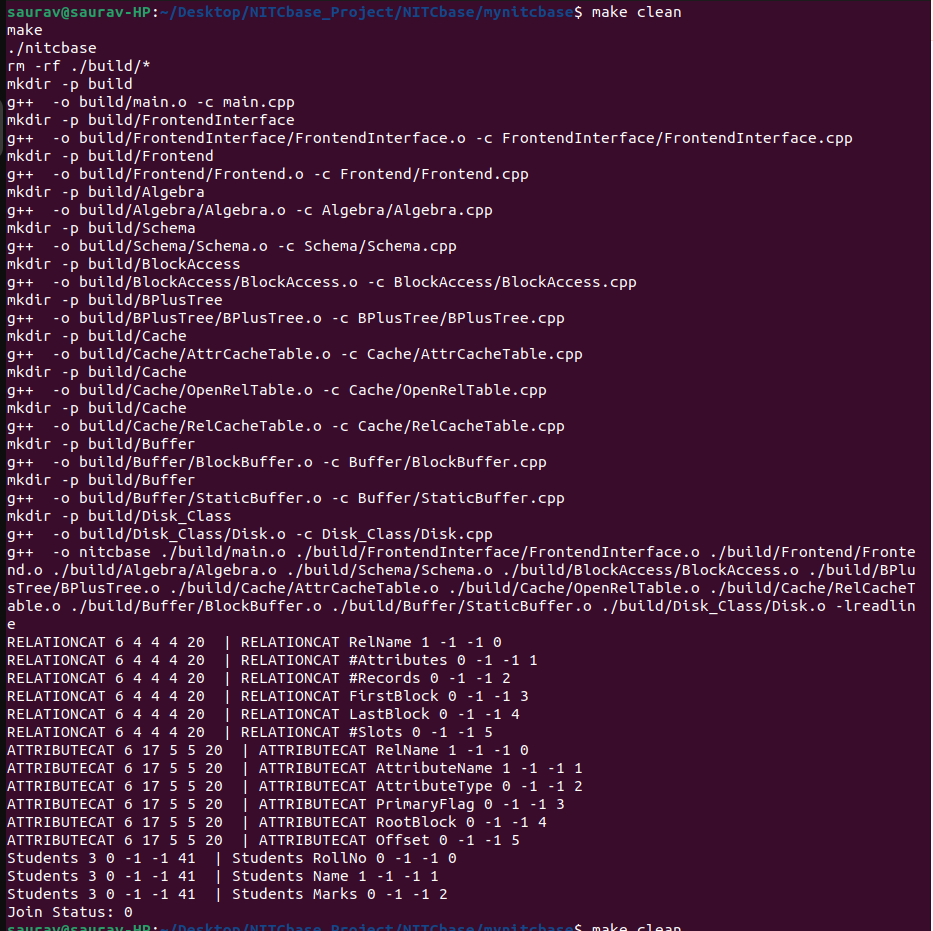
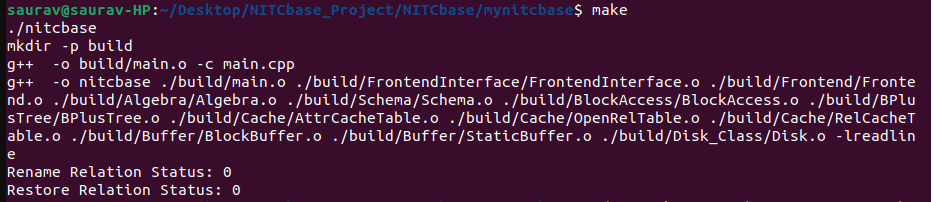

# NITCbase Project

A mini relational database management system (RDBMS) built in **C++** by following the official NITCbase roadmap.

This project demonstrates how a database works internally, starting from disk block storage up to relational algebra operations like select, project, and join.

---

## Project Overview

The goal of this project was to understand and implement the core internal working of a DBMS.

The implementation starts from low-level disk operations and gradually builds higher layers such as buffer management, cache management, schema handling, and query operations.

---

## Build and Run

Compile:

make clean
make

Run:

./nitcbase


## Screenshots   ← paste here

### Project Build


### Projection Output


### Selection Output


### Join Output


### Rename Output



## Technologies Used
## Step-by-Step Implementation

### 1. Project Setup

The project was created and compiled using:

```bash
make
```

The required `readline` library was installed for frontend interaction.

---

### 2. Disk Layer

Implemented:

* `Disk::readBlock()`
* `Disk::writeBlock()`

Purpose:

* Reads fixed-size blocks from the database file
* Writes modified blocks back to disk

This is the lowest storage layer.

---

### 3. Buffer Layer

Implemented:

* `StaticBuffer`
* `BlockBuffer`
* `RecBuffer`

Purpose:

* Loads disk blocks into memory
* Reduces repeated disk access
* Improves speed

---

### 4. Cache Layer

Implemented:

* `RelCacheTable`
* `AttrCacheTable`
* `OpenRelTable`

Purpose:

* Stores relation metadata in memory
* Stores attribute metadata in memory
* Tracks opened relations

This helps fast metadata access.

---

### 5. Linear Search

Implemented:

* `BlockAccess::linearSearch()`
* `BlockAccess::search()`

Purpose:

* Searches records by scanning one by one
* Finds records matching conditions

---

### 6. Record Insert

Implemented:

* `BlockAccess::insert()`

Purpose:

* Inserts records into free slots
* Updates slot map and headers

Example:

```text
101 Saurav 95
```

---

### 7. Relation Open / Close

Implemented:

* `OpenRelTable::openRel()`
* `OpenRelTable::closeRel()`

Purpose:

* Opens relations into cache
* Closes them after use

---

### 8. Create / Delete Relation

Implemented:

* `Schema::createRel()`
* `Schema::deleteRel()`

Purpose:

* Adds relation metadata into `RELATIONCAT`
* Adds attribute metadata into `ATTRIBUTECAT`
* Deletes relation and its attributes

---

### 9. Projection

Implemented:

* `BlockAccess::project()`

Purpose:

* Reads records from relation

Output example:

```text
RELATIONCAT 6 4 4 4 20
```

---

### 10. Rename Operations

Implemented:

* `BlockAccess::renameRelation()`
* `BlockAccess::renameAttribute()`

Purpose:

* Rename table names
* Rename column names

Example:

```text
Students → Learners → Students
```

---

### 11. Selection

Implemented:

* `Algebra::select()`

Purpose:

* Select records using conditions

Example:

```text
SELECT * FROM Students WHERE Name = "Saurav"
```

---

### 12. Join Operation

Implemented:

* `Algebra::join()`

Purpose:

* Combines two relations using common attributes

Example:

```text
RELATIONCAT JOIN ATTRIBUTECAT ON RelName
```

---

## Roadmap Progress

| Stage | Status |
|---|---|
| Stage 0 | Completed |
| Stage 1 | Completed |
| Stage 2 | Completed |
| Stage 3 | Completed |
| Stage 4 | Completed |
| Stage 5 | Completed |
| Stage 6 | Completed |
| Stage 7 | Completed |
| Stage 8 | Completed |
| Stage 9 | Completed |
| Stage 10 | Completed |
| Stage 11 | Completed |
| Stage 12 | Completed |

---

## Project Structure

* `Algebra/` → Relational operations
* `BlockAccess/` → Record access methods
* `Buffer/` → Buffer management
* `Cache/` → Metadata caching
* `Disk_Class/` → Disk operations
* `Frontend/` → User interface
* `FrontendInterface/` → Command parser
* `Schema/` → Schema management
* `define/` → Constants and IDs

---

## Build and Run

Compile:

```bash
make clean
make
```

Run:

```bash
./nitcbase
```

---

## Technologies Used

* C++
* File Handling
* Data Structures
* Buffer Management
* Relational Algebra
* Database Internals

---

## Future Work

* B+ Tree Indexing
* Index-based Search
* Query Optimization
* Full SQL Support

---

## Author

**Saurav Kumar Singh**
B.Tech CSE
National Institute of Technology Calicut
